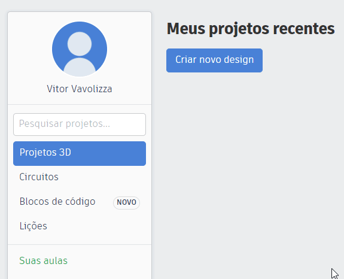

<center>Construa um app de Arduino que toca a música do Meme do Caixão</center>  
<center>Feito por <a href="https://github.com/rohan-bansal" target="_blank">@rohan-bansal</a></center>
<center>Traduzido por <a href="https://github.com/vitorvavolizza" target="_blank">@vitorvavolizza</a></center>

<br />


## Visão geral

As músicas de memes estão por toda parte! Aposto que você já deve ter escutado pelo menos uma vez [All Star](https://www.youtube.com/watch?v=L_jWHffIx5E) ou [O Meme do Caixão](https://www.youtube.com/watch?v=j9V78UbdzWI) pela internet. Neste workshop para iniciantes, você estará construindo/programando um circuito Arduino que será capaz de tocar essas músicas!

Vamos usar o circuito interativo do Tinkercad, que é excelente; é como construir um circuito Arduino na vida real. Com a experiência que você ganhará ao construir este circuito online, recriá-lo com componentes físicos será tranquilinho!

**O que você vai aprender**

- Como ligar um circuito, levando em conta aterramento/potência/sinal
- Como programar na linguagem C do Arduino

**O que você vai precisar**

- Conhecimento extremamente básico de qualquer linguagem de programação, não precisa ser C do Arduino
- Conhecimento básico de notas musicais

**Circuito final**

- Aqui está o código/demo final: [demo](https://www.tinkercad.com/things/4Wu11fxjwpm-danca-do-caixao) 

---

## Configuração

Vamos começar! Vá para o [tinkercad](https://www.tinkercad.com) e registre-se para criar uma conta no canto superior direito. Você deve então ser redirecionado para um painel de controle, no qual você poderá criar um novo diagrama de circuitos. Consulte o GIF abaixo se você estiver tendo problemas:



## A Física da Música

A música, em termos gerais, pode ser descrita como som. Um som muito agradável e digno de dançar! Se tivéssemos que abstrair ainda mais o som, ele pode ser pensado como ondas que se parecem com isto: 


Hora de aula de ciências básicas! As lombadas da onda são chamadas de cristas de onda, e as depressões são chamadas de vales. O comprimento de onda é a distância entre duas cristas adjacentes na onda. A parte importante, porém, é a [**frequência**](https://www.wikiwand.com/pt/Altura_(m%C3%BAsica)). Isto é quantas vezes um comprimento de onda passa por um ponto fixo em uma determinada quantidade de tempo - a frequência é medida em [hertz](https://www.wikiwand.com/pt/Hertz). 

Onde você quer chegar com isso, você pergunta? A frequência da onda está diretamente relacionada ao que você ouve! Quanto maior a frequência, maior a [altura](https://www.wikiwand.com/pt/Altura_(música)), e vice-versa. Isto forma a base para [**notas de música**](https://www.wikiwand.com/pt/Nota_musical). 

Isto é importante porque o Arduino não tem ideia do que é uma nota musical, e nem da campainha que estaremos programando. Para especificar qual nota queremos tocar, precisamos dar ao Arduino o valor em hertz. Por exemplo, a nota C4 é cerca de 261,6 hz! Para uma lista completa das notas e suas frequências, confira [este link](https://pages.mtu.edu/~suits/notefreqs.html). Usaremos essa lista em breve para organizar a música do caixão.

## Construindo o Circuito

Agora que temos uma nova janela de projeto aberta, você verá várias coisas:


Aqui está um resumo dos itens em cada retângulo, da esquerda para a direita:

**Vermelho** : o nome/título de seu projeto

**Verde** : algumas ações pertinentes aos dispositivos, tais como girar, apagar, desfazer/refazer, etc.

**Azul** : o botão para alternar entre a janela de código, botão de simulação e métodos para exportar/compartilhar

**Amarelo**: a janela de componentes com uma enorme variedade de dispositivos para usar

Agora, temos que fazer duas coisas para começarmos. Renomear o projeto clicando no nome no canto superior esquerdo, e arrastar um Arduino da barra de componentes à direita!


Também precisamos adicionar os componentes que estarão tocando nossa música. Em primeiro lugar -piezos! Piezo é a abreviação de [Amplificador Piezoelétrico](https://en.wikipedia.org/wiki/Buzzer#Piezoelectric_2), um circuito oscilante que projeta uma onda sonora. Vá em frente, arraste **dois piezos** para a tela principal, junto com **dois resistores.** Se não conseguir encontrá-los, use a barra de busca. 

Você deve ter isto até agora:

 

Como qualquer dispositivo elétrico, um circuito precisa ser completado para ativá-lo. No caso do piezo, ele precisa de um sinal (energia) e aterramento. 

O terra sempre se conecta à porta terrestre (GND) do Arduino (ao lado do pino 13 no topo da placa), mas como o sinal é variável, ele pode ser conectado a qualquer um dos pinos digitais.

Não vou entrar em detalhes sobre pinos digitais e pinos analógicos, mas você pode definitivamente aprender mais [aqui](https://www.arduinoportugal.pt/grandezas-digitais-e-analogicas-e-pwm/). Tudo o que você precisa saber para esta oficina é que os valores dos hertz inseridos no código serão enviados pelo pino de sinal para o piezo.

A seguir, precisamos configurar os resistores para o valor de resistência correto. Isto assegura que o sinal enviado aos piezos não exceda um certo limite. Clique nos dois resistores e altere os valores da resistência na caixa na parte superior direita como foi configurado abaixo:

 

Você pode ignorar o campo do nome, pois isso não é importante para o circuito, apenas para fins de rotulagem. Certifique-se de que o menu dropdown esteja ajustado para ohms (símbolo de resistência elétrica).

Chegou a hora de ligar o circuito! Ao clicar em uma porta no piezo, resistor ou Arduino, você deverá ser capaz de criar um fio. Conecte o circuito como abaixo:

 

Vamos rever os elementos deste circuito. No pino 6, o fio do sinal primeiro se conecta a um resistor, que se conecta a uma entrada de sinal de um piezo. A outra porta do piezo encaminha a eletricidade para a terra, completando o circuito. O mini-circuito é o mesmo para o pino 7! Não se deixe intimidar pela eletrônica, ela pode ser simplificada.

Viva! Você terminou **a construção do circuito**. Hora de tocar a música do meme!

## Programação do Circuito

Lembra-se do botão de alternar para a janela de código no retângulo azul da foto anterior? Vá em frente e clique nele e mude do código de blocos para o código de texto. Como aqui:


Agora estamos prontos para começar a programação! Vá em frente e apague tudo na janela e digite o seguinte:

```c
void setup() {
    
}

void loop() {
    
}
```

A função `setup()` é executada apenas uma vez durante todo o tempo de execução: no início. Você pode pensar nela como a configuração do programa que está por vir.

A função `loop()` é executada provavelmente centenas de vezes por segundo! Ela itera repetidamente, até que o programa trave ou termine.

Para os propósitos desta oficina, você não precisa saber o que `void` faz; se quiser, verifique aqui: [identificadores](https://pt.wikibooks.org/wiki/Java/Identificadores) (o link o leva a um tutorial Java, mas em termos de identificadores, é tudo o mesmo)

Na função `setup()`, temos que fazer 2 coisas:

- dizer ao Arduino que vamos utilizar o pino 6
- dizer ao Arduino que vamos usar o pino 7

Para isso, precisamos especificar que ambos os pinos serão saídas, não entradas (já que estamos transmitindo som **do** Arduino **para** os piezos):

```c
void setup() {
  pinMode(6, OUTPUT);
  pinMode(7, OUTPUT);
}
```

Existem vários modos de pinos além do OUTPUT, nós simplesmente não os usaremos neste workshop. Para saber mais, confira [este link](https://www.arduino.cc/reference/pt/language/functions/digital-io/pinmode/). 

Vamos tentar fazer alguns sons básicos! Na função `loop()`, adicione o seguinte e aperte o botão **Iniciar Simulação** quando estiver pronto. Você deve ouvir uma nota sendo tocada repetidamente!

```c
void loop() {
    tone(6, 261, 1000);
    delay(1000);
    noTone(6);
    delay(200);
}
```

Linha por linha:

1. Chamamos a função `tone` (tom) que já é incorporada que pega como parâmetros (da esquerda para a direita): número do pino, hertz (nota), duração (milissegundos)
2. Atrasamos o programa em 1000 milissegundos para permitir que o tom seja reproduzido
3. Desabilitamos o tom do piezo ligado ao pino 6
4. Atrasamos novamente por 200 milissegundos para permitir um período entre as notas


Agora, o objetivo de ter dois piezos é que o som circule entre eles! Para fazer isso, precisamos manter um registro do alto-falante atual que está sendo usado. Vá em frente e acrescente uma variável que faça isso no topo do arquivo, voltaremos a ela mais tarde:

```c
int amplificadorAtual = 6;

void setup()
{
  pinMode(6, OUTPUT);
  pinMode(7, OUTPUT);
}
void loop() {
    tone(6, 261, 1000);
    delay(1000);
    noTone(6);
    delay(200);
}
```

Este código funciona, e podemos por todos os meios criar uma música com isto, mas digitar **quatro linhas por nota** vai ser um grande incômodo. É aqui que as [funções](https://www.ime.usp.br/~leo/mac2166/2017-1/introducao_funcoes.html#:~:text=A%20ideia%20b%C3%A1sica%20de%20uma,e%20posterior%20invoca%C3%A7%C3%A3o%20%C3%A0%20fun%C3%A7%C3%A3o.), partes reutilizáveis de código, entram!

Vamos criar uma nova função abaixo da `setup()` , chamada `tocar()` que aceita dois valores, hertz e tempo de espera em milissegundos.

```c
void tocar(float hz, int espera) {
    
}
```

Vamos supor também que só vamos usar o piezo no pino 6, por enquanto. Adicione o seguinte dentro da função `tocar()`:

```c
void tocar(float hz, int espera) {
  tone(6, hz, 1000);
  delay(200);
  noTone(6);
  delay(espera);
}
```

O que fizemos aqui? Já que estamos usando apenas o piezo no pino 6, por que temos que especificá-lo o tempo todo? Para facilitar nossas vidas, podemos adicionar isso manualmente à função, de modo que quando chamamos `tocar()`, não é necessário o número do pino. Também assumimos o atraso e a duração das notas, já que estas provavelmente permanecerão constantes durante esta oficina.

Vamos testar esta função! Apague todo o código dentro de `loop()` , e acrescente isto em seu lugar:

```c
void loop() {
  tocar(261, 500);
}
```

Aperte o botão **Iniciar Simulação**, e você deve ouvir uma nota tocando repetidamente. Desta vez, só o fizemos em **uma linha**!

Como podemos modificar isto agora para alternar os sons entre os dois piezos? Usando [declarações `if`](http://tex22.info/rm/CS5-Teacher/Content/Curriculum%20-%20Computer%20Science/CS%205/Mod%2007/040_060_IfElse_Walkthrough(RCC-504).htm)! Modifique sua função `tocar()` como abaixo:

```c
void tocar(float hz, int espera) {

  tone(amplificadorAtual, hz, 1000);
  delay(200);
  noTone(amplificadorAtual);
  delay(espera);
  
  if(amplificadorAtual == 6) {
    amplificadorAtual += 1;
  } else {
    amplificadorAtual -= 1;
  }    
}
```

O que fizemos aqui? Em vez de ajustar o piezo manualmente, temos a variável `amplificadorAtual` para fazer isso por nós! Já que a variável é ajustada para 6 ou 7, é apenas uma questão de alternar entre elas toda vez que a função é chamada. Isto é feito com a declaração if no final; se o valor for 6, ele muda para 7, e se for 7, ele muda de volta para 6.

Pressione **Iniciar Simulação** mais uma vez e você deve ver os sons alternando de ambos os piezos!


A parte difícil foi feita, vamos fazer um pouco de música agora! Referindo-se a [este link](https://pages.mtu.edu/~suits/notefreqs.html) com todas as notas e frequências possíveis, é assim que faríamos para tocar a dança do caixão (substitua o conteúdo da função `loop()` por isso):

```c
void loop() {

  tocar(329, 200); // F-4
  tocar(329, 70);  // F-4
  tocar(493, 100); // B-4
  tocar(440, 200); // A-4
  tocar(392, 200); // G-4
  tocar(369.99, 100); // F#-4
  tocar(369.99, 100); // F#-4
  tocar(369.99, 120); // F#-4
  tocar(440, 150); // A-4
  tocar(392, 80); // G-4
  tocar(369.99, 100); // F#-4
  tocar(329, 150); // F-4
  tocar(246.94, 150); // B-3
  
  
  tocar(392, 70); // G-4
  tocar(369.99, 70); // F#-4
  tocar(392, 70); // G-4
  tocar(369.99, 70); // F#-4
  tocar(392, 70); // G-4
  
  
  tocar(329, 150); // F-4
  tocar(246.94, 150); // B-3
  
  
  tocar(392, 70); // G-4
  tocar(369.99, 70); // F#-4
  tocar(392, 70); // G-4
  tocar(369.99, 70); // F#-4
  tocar(392, 70); // G-4
}
```

Vá em frente e cole isso e clique em **Iniciar Simulação** se quiser ouvir a música do caixão. Coloquei os nomes das notas nos comentários além de cada nota para que você possa consultar a página de frequências das notas acima para criar suas próprias músicas!

O código final está disponível na demonstração no topo desta página. Se você tiver um erro de sintaxe ou um erro de lógica, vá em frente e faça uma verificação disso.

## Hackeando


Este workshop passou por cima do básico de como fazer música com Arduino, mas há muito a ser mudado! Veja se você consegue mexer nas durações das notas para criar acordes (já que o Arduino não suporta tocar várias notas ao mesmo tempo), arranje suas próprias canções, etc. Se você acha quer sua criação está épica, compartilhe-a com a comunidade brasileira do Hack Club!

Aqui estão alguns ramos do projeto que se baseiam no código escrito nesta oficina:

- **Terceiro Piezo**: [demo e código](https://www.tinkercad.com/things/6U6wSm5wYdt-danca-do-caixao-3-piezos)
- **All Star, do Smash Mouth**: [demo e código](https://www.tinkercad.com/things/6hY87OtBXFx-all-star-smash-mouth)
- **Cordeões falsos**: [demo e código](https://www.tinkercad.com/things/0Uo4P6fplaZ-danca-do-caixao-acordes-falsos)

Agora que você terminou de construir este maravilhoso projeto, compartilhe sua bela criação com outras pessoas! Lembre-se, é só mandar a URL do seu projeto!

Você provavelmente conhece as melhores maneiras de entrar em contato com seus amigos e familiares, mas se você quiser compartilhar seu projeto com a comunidade brasileira do Hack Club, não há melhor lugar para fazer isso do que no Discord do Hack Club Brasil.✨

1. Clique [aqui][discord]{:target="_blank"} para fazer parte da nossa comunidade!
2. Depois, poste o link do seu projeto no canal `💡┇criações` para compartilhá-lo com todos os Hack Clubbers!

A comunidade te espera!🎉🎉

[discord]: http://bit.ly/discord-hc-brasil