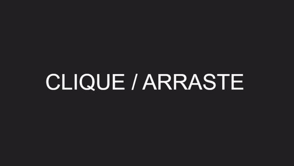

<center>Vamos fazer um sintetizador com a Tone.js</center>  
<center> Feito por <a href="https://github.com/polytroper" target="_blank">@polytroper</a></center>
<center>Traduzido por <a href="https://github.com/vitorvavolizza" target="_blank">@vitorvavolizza</a></center>

<br />

## Sintetizador

Vamos fazer um sintetizador, usando HTML e um divertido pacote do JavaScript chamado Tone.js.

Nota para os líderes de clube: Este workshop é barulhento, portanto, **lembre as pessoas de trazer fones de ouvido!** Traga alguns pares extras, se você puder.

## Minha versão

[Demo ao vivo](https://sintetizador.hcbjcentro.repl.co/) | [Código Fonte](https://repl.it/@hcbjcentro/sintetizador)



## Começando

Abra um novo projeto HTML aqui: [https://repl.it/languages/html](https://repl.it/languages/html)

Delete _tudo_. Você deve deixar o arquivo `index.html` em branco:


Vamos fazer tudo em um só arquivo, por uma questão de simplicidade.

Configure seu `index.html` assim:

```html
<!DOCTYPE html>
<html>
  <head>
    <meta charset="utf-8" />
    <title>Sintetizador</title>
  </head>

  <style>
    /* Seu CSS vai aqui... */
  </style>

  <body>
    <!-- Seu HTML vai aqui... -->
  </body>

  <script>
    // Seu JS vai aqui...
  </script>
</html>
```

## HTML

Primeiro vamos fazer nosso HTML. Nosso sintetizador será um grande botão, então o HTML é apenas um único `div` chamado "pad":

```html
<body>
  <div id="pad"></div>
</body>
```

Agora, se você executar a página, você verá... nada. Então vamos dar algum estilo ao nosso pad.

## CSS

Queremos que o pad ocupe toda a página, por isso vamos colocá-lo na `position: absolute` (absoluta). Isto nos dá controle total sobre a posição e o tamanho deste `div`, em vez de colocá-lo em relação a seus vizinhos.

Em seguida, vamos definir `top` (cima), `left` (esquerda), `right` (direita) e `bottom` (baixo) com o valor 0. Isto significa que haverá zero pixels entre cada lado do `div` e a janela do navegador (em outras palavras, ele preenche a página).

Finalmente, colocaremos `background: black;` (preto) para que você possa enxergá-lo.

Sua seção `style` deve agora estar parecida com esta:

```html
<style>
  #pad {
    position: absolute;

    top: 0;
    left: 0;
    right: 0;
    bottom: 0;

    background: black;
  }
</style>
```

Agora, se você executar a página, você deve obter um grande retângulo preto. O que é bastante promissor.

## JavaScript

Vamos fazer um pouco de barulho usando a Tone.js. Procure por "Tone.js" na aba de Pacotes e clique no ícone de Mais. O Repl.it irá inserir um trecho de código em seu arquivo que diz ao navegador para carregar o Tone.js na nossa página.


Vamos adicionar um pouco de código para fazer com que a Tone faça algo simples. Tente colocar isto em sua seção `script`:

```html
<script>
  Tone.start()
  const sint = new Tone.Synth().toDestination();
</script>
```

Na primeira linha, iniciamos a Tone.js com `Tone.start()`. Depois, definimos um novo sintetizador para emitir nossos sons.

Isto é o que você deve ter até agora:

```html
<!DOCTYPE html>
<html>

<head>
  <meta charset="utf-8" />
  <title>Sintetizador</title>
</head>

<style>
  #pad {
    position: absolute;
    top: 0;
    left: 0;
    right: 0;
    bottom: 0;

    background: black;
  }
</style>

<body>
  <div id="pad"></div>
</body>

<script src="https://cdnjs.cloudflare.com/ajax/libs/tone/14.8.9/Tone.js"></script>

<script>
  Tone.start()
  const sint = new Tone.Synth().toDestination();
</script>

</html>
```

## Adicionando Eventos de Clicar/Tocar

Ok, agora precisamos de uma maneira de ligar e desligar nosso som. Vamos fazer isso criando duas _funções_ e dois _ouvintes_ - as funções vão ligar e desligar o sintetizador, e os ouvintes vão ativar essas funções quando um _ponteiro_ (mouse ou dedo) passar pela página.

Primeiro, adicione as funções `baixo` e `cima`:

```js
Tone.start()
const sint = new Tone.Synth().toDestination();

function baixo(evento) {
  sint.triggerAttack(400)
}
function cima(evento) {
  sint.triggerRelease()
}
```

Agora vamos ouvir os eventos `pointerdown` e `pointerup` em nosso elemento `pad`. Primeiro precisamos encontrar o bloco utilizando `document.getElementById`:

```js
Tone.start()
const sint = new Tone.Synth().toDestination();
var pad = document.getElementById('pad'); // <--

function baixo(evento) {
  sint.triggerAttack(400);
}
function cima(evento) {
  sint.triggerRelease();
}
```

Em seguida, acrescentamos dois ouvintes ao `pad`:

```js
Tone.start()
const sint = new Tone.Synth().toDestination();
var pad = document.getElementById('pad');

function baixo(evento) {
  sint.triggerAttack(400);
}
function cima(evento) {
  sint.triggerRelease();
}

pad.addEventListener('pointerdown', baixo); // <--
pad.addEventListener('pointerup', cima);     // <--
```

Agora, se você executar sua página, o sintetizador deve responder a um clique!

## Adicionando uma Faixa de Toms

É um pouco chato emitir apenas _um_ tom. E se o lado esquerdo da página fosse um tom baixo, e o lado direito fosse um tom alto?

Para fazer isso, precisamos saber onde está o ponteiro.

Nossa função `baixo` inclui uma variável chamada `evento`, que contém dados sobre nosso click-incluindo onde ele aconteceu. Para obter o número de pixels do lado esquerdo da página, utilizamos `evento.pageX`. Obtenha esse valor e coloque-o dentro de um `sint.triggerAttack` assim:

```js
function baixo(evento) {
  var x = evento.pageX;
  sint.triggerAttack(x);
}
```

Agora, se você rodar sua página, você deve obter um tom baixo clicando à esquerda e um tom alto clicando à direita!

## Adicionando um Título ao Tom

E se quisermos saber exatamente qual é o tom que estamos fazendo? Vamos adicionar um título para deixar isso claro.

Dentro de seu sintetizador, adicione mais um `div`, chame-o de `titulo`, e coloque CLIQUE / ARRASTE dentro (vamos adicionar a ação de arrastar mais tarde):

```html
<body>
  <div id="pad">
    <div id="titulo">CLIQUE / ARRASTE</div>
  </div>
</body>
```

Nossa nova tag precisa de um pouco de estilo. Adicione isto à sua seção `style` para mudar a fonte, tamanho, cor e desabilitar a seleção do texto:

```css
#titulo {
  font: 40px Arial;
  color: white;
  user-select: none;
}
```

Agora, se você executar a página você deve ver um grande "CLIQUE / ARRASTE" branco no canto superior esquerdo. Vamos colocar isso no meio da página.

Para centralizar nosso texto, precisamos adicionar três novas propriedades ao `div` `#pad`:

- `display: flex;`, que permite ao `#pad` redimensionar/centralizar automaticamente as coisas
- `justify-content: center;`, o que faz com que tudo o que está dentro do bloco seja centralizado à esquerda/direita.
- `align-items: center;`, que faz com que qualquer coisa dentro do `#pad` seja centralizado ao topo/baixo.

Toda sua seção de estilo deve agora estar parecida com esta:

```html
<style>
  #pad {
    position: absolute;

    top: 0;
    left: 0;
    right: 0;
    bottom: 0;

    background: black;

    display: flex;
    justify-content: center;
    align-items: center;
  }

  #titulo {
    font: 40px Arial;
    color: white;
    user-select: none;
  }
</style>
```

Agora seu texto deve estar bem centralizado - o único problema é que tudo o que ele diz é "CLIQUE / ARRASTE".

Quando acionamos `baixo`, queremos que ele mude nossa tag para mostrar o tom. Quando acionamos `cima`, queremos que ele seja reinicializado para "CLIQUE / ARRASTE".

Para mudar o texto dentro de nossa tag, primeiro precisamos pegar o elemento da tag em JavaScript. Adicione isto ao topo de seu `script`:

```js
var titulo = document.getElementById('titulo');
```

Agora adicione isto à sua função `baixo` para inserir o tom:

```js
titulo.innerHTML = Math.round(x) + 'Hz';
```

E adicione isso à sua função `cima` para resetar:

```js
titulo.innerHTML = 'CLIQUE / ARRASTE';
```

Sua seção `script` deve se parecer com esta:

```html
<script>
  Tone.start()
  const sint = new Tone.Synth().toDestination();
  var pad = document.getElementById('pad');
  var titulo = document.getElementById('titulo');

  function baixo(evento) {
    var x = evento.pageX;
    sint.triggerAttack(x);
    titulo.innerHTML = Math.round(x) + 'Hz';
  }
  function cima(evento) {
    sint.triggerRelease();
    titulo.innerHTML = 'CLIQUE / ARRASTE';
  }

  pad.addEventListener('pointerdown', baixo);
  pad.addEventListener('pointerup', cima);
</script>
```

Quando você rodar a página, deve ver a frequência do tom que está tocando!

## Adicionando Arrastar

Agora, para acrescentar o recurso de arrastar, precisamos de mais uma função como `cima` e `baixo`, chamada `mover`:

```js
function mover(evento) {
  var x = evento.pageX;
  sint.setNote(x);
  titulo.innerHTML = Math.round(x) + 'Hz';
}
```

Note que ela se parece muito com a `baixo`. Ela obtém a posição X do ponteiro, e define o texto da tag de acordo com o tom. A única diferença é que ela chama `sint.setNote(x)` em vez de `sint.triggerAttack(x)`, já que estamos apenas _mudando_ o tom, ao invés de  iniciar um novo tom.

Como a `cima` e `baixo`, também precisamos de um ouvinte para a função `mover`:

```js
pad.addEventListener('pointermove', mover);
```

Agora, quando você executar sua página, você deve ser capaz de clicar e arrastar para mudar o tom!


Ok, um último detalhe: Quando você passa o mouse sobre sua página, ele acionará a `mover` e mostrará uma frequência, mesmo que você ainda não tenha clicado. Portanto, só precisamos de mais uma variável para saber se estamos arrastando. Então acrescente uma variável para isso no topo de sua seção `script`:

```js
var arrastando = false;
```

Coloque isso na função `baixo`:

```js
arrastando = true;
```

Coloque isso na função `cima`:

```js
arrastando = false;
```

E coloque todo o seu código de dentro da função `mover` aqui:

```js
if (arrastando) {
  // seu código da mover
}
```

Agora sua seção script deve estar assim:

```html
<script>
  const sint = new Tone.Synth().toDestination();
  var pad = document.getElementById('pad');
  var titulo = document.getElementById('titulo');
  var arrastando = false;

  function baixo(evento) {
    arrastando = true;
    var x = evento.pageX;
    sint.triggerAttack(x);
    titulo.innerHTML = Math.round(x) + 'Hz';
  }
  function cima(evento) {
    arrastando = false;
    sint.triggerRelease();
    titulo.innerHTML = 'CLIQUE / ARRASTE';
  }
  function mover(evento) {
    if (arrastando) {
      var x = evento.pageX;
      sint.setNote(x);
      titulo.innerHTML = Math.round(x) + 'Hz';
    }
  }

  pad.addEventListener('pointerdown', baixo);
  pad.addEventListener('pointerup', cima);
  pad.addEventListener('pointermove', mover);
</script>
```

Vá em frente e experimente. Se tudo estiver configurado, você deve ter um sintetizador deslizante totalmente funcional!

## Por hoje é só pessoal!

Para referência, aqui está todo o meu arquivo `index.html` no final do workshop:

```html
<!DOCTYPE html>
<html>

<head>
  <meta charset="utf-8" />
  <title>Sintetizador</title>
</head>

<style>
  #pad {
    position: absolute;

    top: 0;
    left: 0;
    right: 0;
    bottom: 0;

    background: black;

    display: flex;
    justify-content: center;
    align-items: center;
  }

  #titulo {
    font: 40px Arial;
    color: white;
    user-select: none;
  }
</style>

<body>
  <div id="pad">
    <div id="titulo">CLIQUE / ARRASTE</div>
  </div>
</body>

<script src="https://cdnjs.cloudflare.com/ajax/libs/tone/14.8.9/Tone.js"></script>

<script>
  const sint = new Tone.Synth().toDestination();
  var pad = document.getElementById('pad');
  var titulo = document.getElementById('titulo');
  var arrastando = false;

  function baixo(evento) {
    arrastando = true;
    var x = evento.pageX;
    sint.triggerAttack(x);
    titulo.innerHTML = Math.round(x) + 'Hz';
  }
  function cima(evento) {
    arrastando = false;
    sint.triggerRelease();
    titulo.innerHTML = 'CLIQUE / ARRASTE';
  }
  function mover(evento) {
    if (arrastando) {
      var x = evento.pageX;
      sint.setNote(x);
      titulo.innerHTML = Math.round(x) + 'Hz';
    }
  }

  pad.addEventListener('pointerdown', baixo);
  pad.addEventListener('pointerup', cima);
  pad.addEventListener('pointermove', mover);
</script>

</html>
```

Se você checar a versão "original" que coloquei no topo, você notará algumas diferenças como cores bonitas e um som diferente. Confira meu [código fonte](https://repl.it/@hcbjcentro/sintetizador) para ver como eu fiz isso, e tente adicionar algumas novas características próprias!

Agora que você terminou de construir este maravilhoso projeto, compartilhe sua bela criação com outras pessoas! Lembre-se, é só mandar a URL do seu projeto!

Você provavelmente conhece as melhores maneiras de entrar em contato com seus amigos e familiares, mas se você quiser compartilhar seu projeto com a comunidade brasileira do Hack Club, não há melhor lugar para fazer isso do que no Discord do Hack Club Brasil.✨

1. Clique [aqui][discord]{:target="_blank"} para fazer parte da nossa comunidade!
2. Depois, poste o link do seu projeto no canal `💡┇criações` para compartilhá-lo com todos os Hack Clubbers!

A comunidade te espera!🎉🎉

[discord]: http://bit.ly/discord-hc-brasil