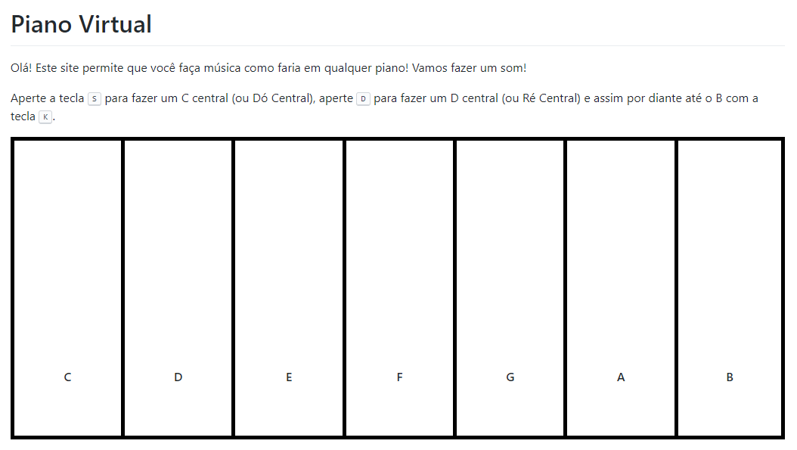

---

title: 'Sintonia com JS'
description: 'Faça um piano no navegador utilizando Tone.js'  
bg-image: "/workshops/sintonia-com-js/img/fundo-piano.png"
permalink: /workshops/sintonia/
order: 12

---

<center>Faça um piano no navegador utilizando Tone.js</center>  
<center>Feito por <a href="https://github.com/sampoder" target="_blank">@sampoder</a></center>
<center>Traduzido por <a href="https://github.com/vitorvavolizza" target="_blank">@vitorvavolizza</a></center>

<br />

Todos nós já tentamos tocar um piano, pensando que estamos criando um som extraordinário (claro que estamos!). Ok, talvez seja apenas eu. Hoje, pensei que seria legal se criássemos um piano usando HTML & JavaScript tudo com a ajuda de uma grande biblioteca chamada <a href="http://tonejs.github.io/" target="_blank">Tone.js</a>!

## Começando

Estaremos escrevendo código no Repl.it hoje. Ele é um editor de código online, pense nele como o Google Docs para programação! Durante este workshop, iremos focar no JavaScript que executará o projeto, por isso preparei um código inicial para você usar. Vá para [este código inicial](https://repl.it/@hcbjcentro/piano).

Deixe-me apenas explicar rapidamente o código inicial. Você encontrará três arquivos: `index.html`, `style.css` e `script.js`. O arquivo JavaScript está atualmente vazio, por outro lado, o resto dos arquivos foi configurado para criar uma interface de usuário básica.

No topo do arquivo `index.html` referenciamos nossas folhas de estilo e metadados. Para tornar o estilo super fácil, acrescentei também <a href="https://github.com/sindresorhus/github-markdown-css" target="_blank">um arquivo CSS que faz parecer com o estilo do GitHub</a>.



```html
<body class="markdown-body">
  <div>
    <h1>Piano Virtual</h1>
    <p>
      Olá! Este site permite que você faça música como faria em qualquer piano!
      Vamos fazer um som!
    </p>
    <p>
      Aperte a tecla <kbd>S</kbd> para fazer um C central (ou Dó Central), aperte
      <kbd>D</kbd> para fazer um D central (ou Ré Central) e assim por diante 
      até o B com a tecla <kbd>K</kbd>.
    </p>
  </div>
  <div id="piano">
    <span class="tecla" id="C"><strong>C</strong></span>
    <span class="tecla" id="D"><strong>D</strong></span>
    <span class="tecla" id="E"><strong>E</strong></span>
    <span class="tecla" id="F"><strong>F</strong></span>
    <span class="tecla" id="G"><strong>G</strong></span>
    <span class="tecla" id="A"><strong>A</strong></span>
    <span class="tecla" id="B"><strong>B</strong></span>
  </div>
  <script src="https://cdnjs.cloudflare.com/ajax/libs/tone/14.7.52/Tone.js"></script>
  <script src="script.js"></script>
</body>
```

Vou explicar o que está acontecendo no HTML. A classe aplicada à tag `<body>` garante que os estilos Github Markdown sejam aplicados. Depois, na primeira tag `<div>`, fornecemos uma introdução básica ao site. Depois, no segundo `div` há um elemento `span` para cada chave que estaremos utilizando. Então, no final, adicionamos todos os nossos scripts Javascript. Deixe-me me explicar agora o arquivo CSS:

```css
body {
  width: 75vw;
  margin: auto;
}

#piano {
  height: 400px;
}

.tecla {
  height: 400px;
  width: 14.2857142857%;
  float: left;
  border: 5px solid black;
  border-right: none;
  background: white;
  text-align: center;
  padding-top: 300px;
}

#B {
  border-right: 5px solid black;
}
```

Primeiramente, a tag `body` é definida para ter uma largura de 75vw e centralizada utilizando `margin: auto;`. Em segundo lugar, definimos o div `#piano` para ter uma altura de 400px. Como há muito pouco conteúdo nas teclas, isto garantirá que elas sejam grandes e pareçam realistas. Em seguida, fazemos com que cada tecla tenha a altura correta, tenha uma largura de um sétimo do div e tenha uma borda e um fundo branco. Por último, a tecla Si terá uma borda direita, pois ela vem no final.

Espero que você entenda o código inicial, agora você pode estar ficando entediado, então vamos começar a brincadeira!

# Detectando quando uma tecla for apertada

Para tocar uma nota em nosso projeto, o usuário pressionará uma tecla em seu teclado. O Javascript tem um evento para isso: `document.onkeydown`. Isto é disparado quando uma tecla é pressionada.

Por exemplo, no trecho abaixo:

```javascript
document.onkeydown = function (e) {
  console.log('Tecla Pressionada!')
}
```

Sempre que uma tecla for pressionada, ela imprimirá 'Tecla pressionada!' Você pode tentar também! Basta digitar isto em seu arquivo `script.js`, clicar em 'Run', depois clicar na visualização do navegador e pressionar uma tecla. Você deve ver as impressões no console.

O próximo passo é saber qual tecla pressionamos, teremos que obter um pouco mais de informação para fazer isso. Podemos fazer isso com o seguinte trecho:

```javascript
document.onkeydown = function (e) {
  var tecla = e.which
  console.log(tecla)
}
```
Construindo sobre nossa função anterior, estamos agora obtendo dados do navegador através do evento. Com esses dados obtemos um código de tecla que pode ser usado para identificar a tecla que foi pressionada. O trecho obtém todas as informações do evento que disparou a função.

O que este código faz é receber a informação do evento (a tecla que está sendo pressionada) que está acontecendo. Em seguida, ele extrai o código da tecla dessa informação.

Você verá que, ao executar isto, nossa tecla é um número!? Isso ocorre porque cada tecla tem seu próprio código. <a href="https://keycode.info" target="_blank">keycode.info</a> é uma ferramenta super útil para ajudá-lo a identificar os códigos para cada tecla.


Agora que sabemos como identificar a tecla, vamos imprimir o evento se a tecla pressionada por `S`. O código da tecla é `83`. Usaremos um declaração if/else para isso.

```javascript
document.ontecladown = function (e) {
  var tecla = e.which
  if (tecla === 83) {
    console.log('S foi pressionado.')
  }
}
```

Nós conseguimos!

## Tocando um som

Agora é hora de tocar um som com a Tone.js! Primeiro vamos iniciar a Tone.js. Acrescente o seguinte no topo do arquivo Javascript:

```javascript
Tone.start()
const synth = new Tone.Synth().toDestination()
```

Isto inicia o Tone.js e depois cria um sintetizador para que possamos tocar uma nota.

Vamos utilizar o Tone.js em uma função JavaScript.

```javascript
function tocarNota(nota) {
  synth.triggerAttackRelease('C4', '8n')
}
```

Eis como criamos uma função. O nome de nossa função será `tocarNota` e será necessária uma variável chamada `nota` para ser fornecida quando a função for chamada. Então, dentro dessa função, ela tocará a tecla C durante 8 notas.

Entretanto, não estamos utilizando nossa variável `nota`. Vamos adicioná-la ao utilizar template strings. Os templates de strings nos permitem adicionar variáveis em nossas strings. Para fazer isso, usamos o caractere <code>`</code> em vez de <code>'</code>.

Então, sempre que quisermos usar uma variável como, por exemplo, nota, podemos fazer assim: `${nota}`.

Colocando isso, ficará assim:

```javascript
function tocarNota(nota) {
  synth.triggerAttackRelease(`${nota}4`, '8n')
}
```

O 4 é mantido do jeito que está, a seção do teclado. No momento, vamos manter o mesmo.

Agora vamos voltar para o nosso evento de pressionamento do teclado. Vamos fazer com que ele acione com esta nova função que fizemos.

Podemos fazer isso substituindo `console.log('S foi pressionado.')` por `tocarNota('C')`.

Teste! Ao clicar na tecla <kbd>S</kbd>, você deve ouvir a nota C!!

Agora você pode replicar isto com as outras teclas?

- <kbd>D</kbd> deve tocar a nota D.
- <kbd>F</kbd> deve tocar a nota E.
- <kbd>G</kbd> deve tocar a nota F.
- <kbd>H</kbd> deve tocar a nota G.
- <kbd>J</kbd> deve tocar a nota A. (Sim, os pianos começam no C...)
- <kbd>K</kbd> deve tocar a nota B.

Lembre-se, você pode utilizar: <a href="https://keycode.info" target="_blank">keycode.info</a>.

## Tornando a UI interativa

Como a pessoa vai saber a tecla que clicou? Vamos dar uma confirmação visual! Temos cada tecla em um elemento separado, então vamos mudar o fundo da tecla quando ela for atingida. Podemos fazer adicionando esta linha à nossa função `tocarNota()`:

```javascript
document.getElementById(nota).style.background = 'turquoise'
```

O que isso faz, é obter o elemento com o ID com o nome da variável nota. Se você olhar acima, eu defino o ID de cada `<span>` para ser o mesmo de sua nota correspondente. Ele então define o fundo para ser da cor 'turquoise'.

Execute o código! O que acontece?

As teclas ficam verdes, mas permanecem verdes!!!! NÃÃÃOOOO..... Temos que mudar isto, vamos adicionar esta linha de código:

```javascript
setTimeout(() => {
  document.getElementById(nota).style.background = 'white'
}, 200)
```

Isto fará o fundo voltar para branco após 200 milissegundos.


E nós conseguimos! Muito bem.

## Indo além!

Construímos um projeto básico, agora vamos fazê-lo ÉPICO! O poder está com você, mas gostaria de lhe dar alguma inspiração:

- [Um piano que dá ao usuário mais controle](https://hopeful-mclean-c9c978.netlify.app/) Esta versão do piano permite que você use a tecla <kbd>SHIFT</kbd> para digitar uma tecla preta e <kbd>⬅︎</kbd> ou <kbd>⮕</kbd> para mover-se para baixo do teclado.
- [Um piano que fica louco.](https://optimistic-bhaskara-1870c3.netlify.app) Este piano não se importa, o que quer que você clique nele não se importa! Reproduz sons aleatórios com cores aleatórias e algumas mensagens muito amáveis!
- [Um piano global, um piano onde todos podem tocar e outros podem ouvir!](https://global-piano.herokuapp.com) Construído com Socket.io, eu adaptei este projeto para poder fazer isso. Tente abrir o site em várias abas para tocar :)

Agora que você terminou de construir este maravilhoso projeto, compartilhe sua bela criação com outras pessoas! Lembre-se, é só mandar a URL do seu projeto!

Você provavelmente conhece as melhores maneiras de entrar em contato com seus amigos e familiares, mas se você quiser compartilhar seu projeto com a comunidade brasileira do Hack Club, não há melhor lugar para fazer isso do que no Discord do Hack Club Brasil.✨

1. Clique [aqui][discord]{:target="_blank"} para fazer parte da nossa comunidade!
2. Depois, poste o link do seu projeto no canal `💡┇criações` para compartilhá-lo com todos os Hack Clubbers!

A comunidade te espera!🎉🎉

[discord]: http://bit.ly/discord-hc-brasil